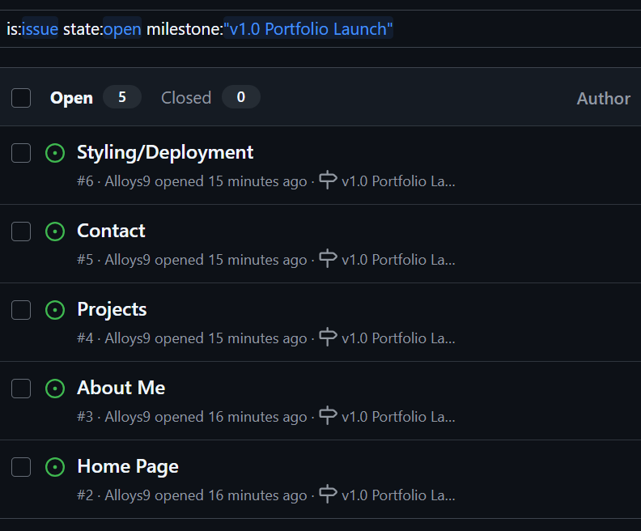
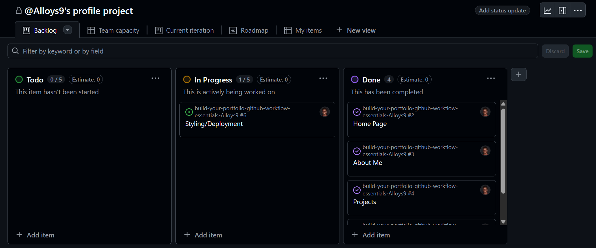
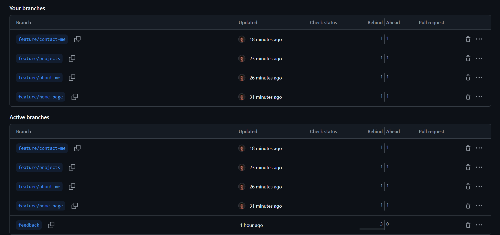
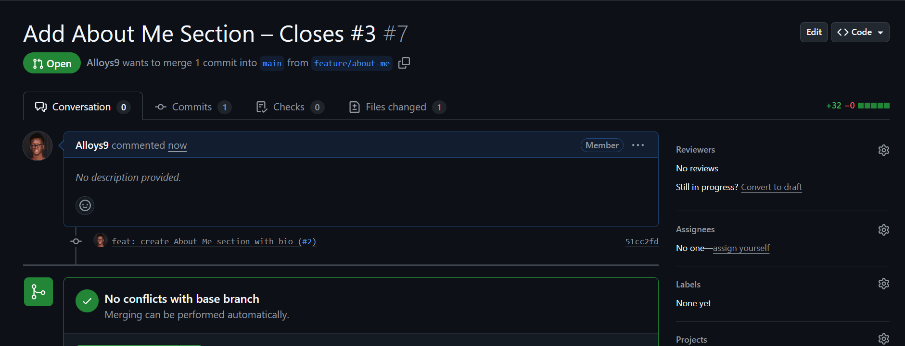
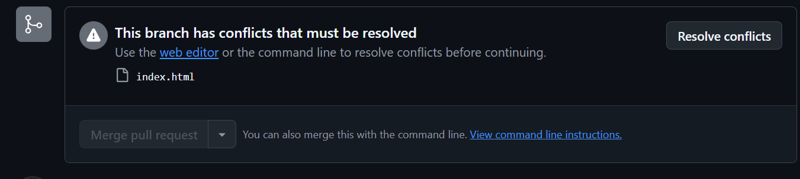

# Personal Portfolio Documentation

## 1. Student Details

* **Full Name**: Alloys Amasakha
* **Admission Number**: 150213
* **GitHub Username**: Alloys9
* **Email**: [alloys.amasakha@strathmore.edu](mailto:alloys.amasakha@strathmore.edu)

---

## 2. Deployed Portfolio Link

* **GitHub Pages URL**:
  [https://is-project-4th-year.github.io/build-your-portfolio-github-workflow-essentials-Alloys9/](https://is-project-4th-year.github.io/build-your-portfolio-github-workflow-essentials-Alloys9/)

---

## 3. Learnings from the Git Crash Program

### **🧠 What I Thought I'd Learn vs What I Actually Learned**

---

**1. Concept: Branching**

* `Expectation`: I thought branches were mostly for big teams like working on huge software projects.
* `Reality`: Turns out branching is just as important in solo work. It kept my portfolio organized and allowed me to work on individual features without touching the main code.
* `Impact`: I used branches like `feature/about-me` and `feature/projects-section`, which helped me isolate sections and avoid errors on the live site.

---

**2. Concept: Pull Requests**

* `Expectation`: I thought pull requests were only necessary when other people are reviewing your code.
* `Reality`: I discovered that PRs help *me* track my changes, test features before merging, and link to issues cleanly.
* `Impact`: I opened pull requests for every section like Home and Contact and merged them only after testing locally. This kept my workflow clean.

---

**3. Concept: Issues and Milestones**

* `Expectation`: I assumed issues and milestones were more of a formality. I didn’t think I’d need them for a personal site.
* `Reality`: They actually gave me a clear structure and timeline. Each section of my portfolio was an issue tied to a `v1.0 Portfolio Launch` milestone.
* `Impact`: I stayed on track by treating each issue like a task, and seeing milestone progress hit 100% felt super rewarding.

---

**4. Concept: GitHub Pages Deployment**

* `Expectation`: I thought deployment to GitHub Pages would be confusing or require coding.
* `Reality`: It was surprisingly easy just choose the `main` branch in GitHub Pages settings.
* `Impact`: It took less than a minute to publish my site live. This helped me test changes instantly and made sharing my work easy.

---

## 4. Screenshots of Key GitHub Features
### A. Milestones and Issues

```markdown

```

**Caption**: This screenshot shows the milestone `v1.0 Portfolio Launch` with issues like “Home Page” and “Contact” linked to it.

---

### B. Project Board

```markdown

```

**Caption**: The GitHub Project Board helped me organize my tasks into “To Do”, “In Progress”, and “Done” columns.

---

### C. Branching

```markdown

```

**Caption**: Each section of my portfolio had its own feature branch (e.g. `feature/home-page`, `feature/about-me`) for better isolation and testing.

---

### D. Pull Requests

```markdown

```

**Caption**: This pull request shows how I merged the “About Me” section into the `main` branch after testing it. It’s linked to Issue #2.

---

### E. Merge Conflict Resolution

```markdown

```

**Caption**: I encountered a small conflict when merging the style changes. I resolved it manually and committed the fix.

